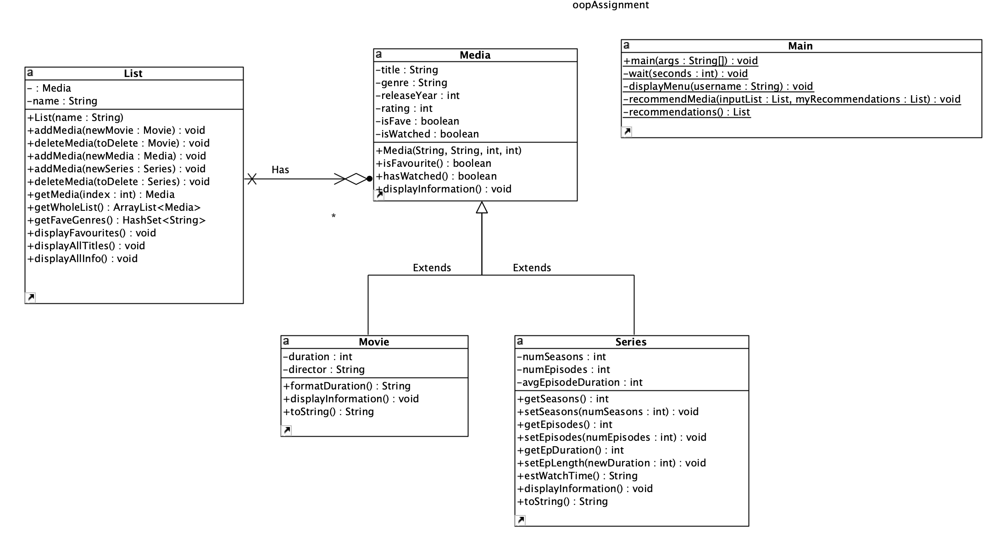

# ICS4U OOP Assignment

[*see instructions for details*](Instructions.md)

**Class Diagram**

## Summary
The system that is being modelled is a Netflix-like media library. When you log on to the system, you are given a preview of "My List", which is a list of watched TV Series and Movies. 

A list *(e.g. My List or My Recommendations)* is defined by the List class;

 A **List** object is a Media-type arraylist, which is able to have Movies and Series (has-a relationship). The List class has a collection of methods that are able to add/delete media from the list, display certain aspects of the media list, and also determine favourite genres based on the contents of the list. 

A **Media** object has the following attributes: a title, genre, release year, rating, a boolean value that indicates whether the movie is a favourite, and a boolean value indicating if the movie has been watched. This is a parent class for **Movie** and **Series** classes.

A **Movie** *extends* **Media**, which means it inherits the above attributes and also has additional class-specific attributes. For example, a movie has a director and duration.

A **Series** also *extends* **Media**, which means it also inherits the above mentioned attributes and has additional attributes. A series is more detailed, as it also has a number of seasons, numbder of episodes, and the average episode duration which is used to calculated the total duration. 

Getting back to how the program functions, the user is able to choose from a variety of options in a menu. They are able to view their favourite titles, view their list in detail, view their recommendations based off their favourite titles, and "expand taste", which recommends titles of all genres. After being displayed recommendations, the user is asked whether or not they chose to watch any of the recommended movies. If they have, the user may indicate the media index (specified in a number on top of the media title) and also rate the media on a scale of 1 - 10. This changes the rating, and adds the recommended media to their watched list. This simulates how one would watch something on Netflix as it would be marked as "watched" and one would be able to indicate whether or not they enjoyed the media. Finally, the user may indicate when they want to exit Natflix, which would simply prompt a "Goodbye" message and stop the program.